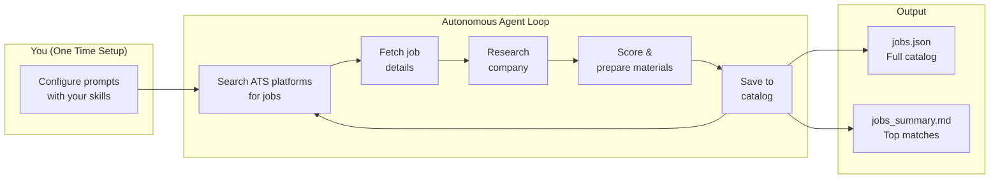
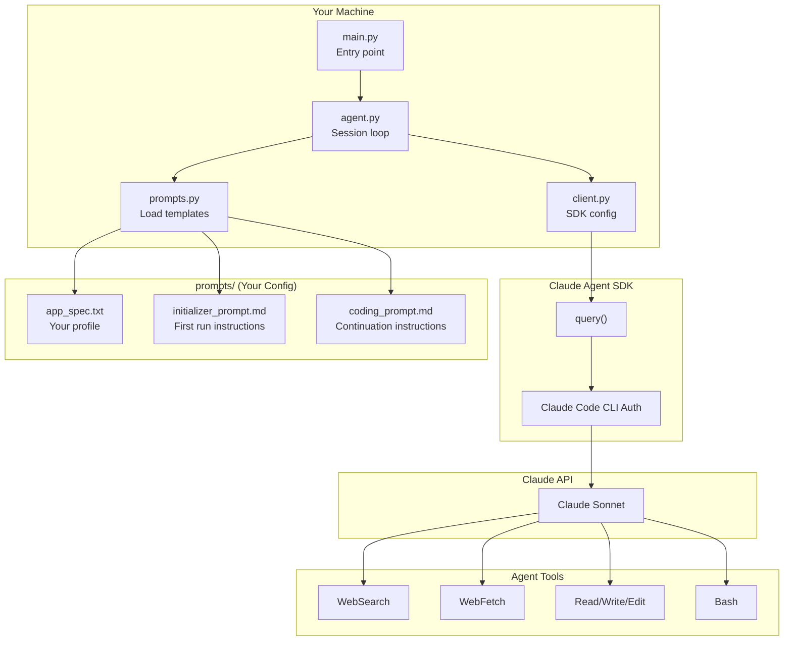
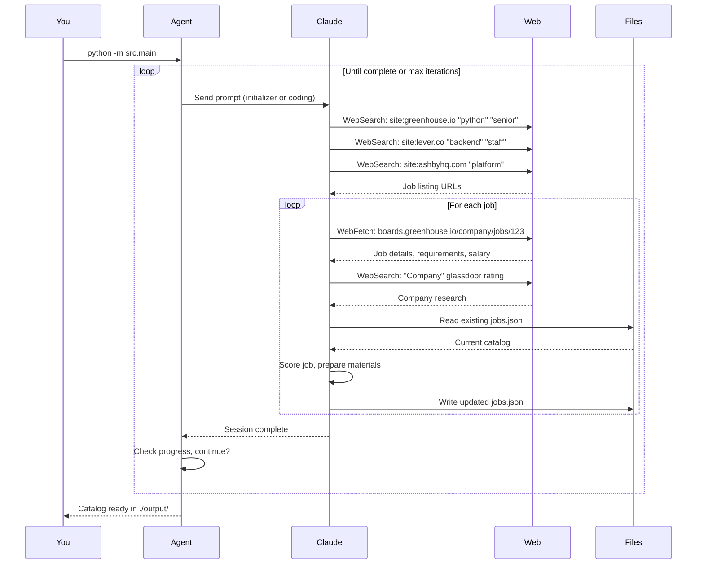

# autonomous-job-search

> Autonomous job search agent powered by Claude. Searches multiple ATS platforms, researches companies, and prepares application materials - you just apply.

## How It Works

This tool uses the **Claude Agent SDK** which leverages your existing **Claude Code CLI** authentication. No API keys to manage - if you're logged into Claude Code, you're ready to go.



## Supported ATS Platforms

The agent searches across multiple Applicant Tracking Systems:

| Platform | Domain | Companies Using It |
|----------|--------|-------------------|
| **Greenhouse** | `boards.greenhouse.io` | Stripe, Airbnb, Datadog, Figma, Notion, Cloudflare, Discord |
| **Lever** | `jobs.lever.co` | Netflix, Shopify, Twitch, Lyft, Atlassian |
| **Ashby** | `jobs.ashbyhq.com` | Ramp, OpenAI, Deel, Vercel, Linear |
| **Workable** | `apply.workable.com` | Various startups and mid-size companies |

You can configure the agent to focus on specific platforms or search all of them.

## Architecture



## Quick Start

### Prerequisites

- Python 3.12+
- [Claude Code CLI](https://docs.anthropic.com/en/docs/claude-code) installed and authenticated
- That's it! No API key needed.

### Setup

```bash
# Clone
git clone https://github.com/stxkxs/autonomous-job-search.git
cd autonomous-job-search

# Install
uv venv && source .venv/bin/activate
uv pip install -e .

# Configure your profile
cp prompts/app_spec.txt.example prompts/app_spec.txt
cp prompts/coding_prompt.md.example prompts/coding_prompt.md
cp prompts/initializer_prompt.md.example prompts/initializer_prompt.md

# Edit each file with YOUR details (skills, experience, target roles)
# These files are gitignored - your personal info stays private
```

### Run

```bash
# Start the agent
python -m src.main --project-dir ./output

# Watch it work autonomously...
# Ctrl+C to stop (you can resume anytime)
```

## Agent Workflow



## Configuration

### Prompt Files

The `prompts/` directory defines your job search. Files are gitignored to keep your personal details private.

| File | Purpose |
|------|---------|
| `app_spec.txt` | **Your profile** - name, location, skills, experience, target roles |
| `initializer_prompt.md` | **First run** - how to search, what companies to target |
| `coding_prompt.md` | **Continuation** - how to add more jobs without duplicates |

### CLI Options

```bash
# Specify output directory
python -m src.main --project-dir ./my-job-search

# Limit iterations (default: 50)
python -m src.main --max-iterations 10

# Filter by skills
python -m src.main --skills java kubernetes aws

# Use different model
python -m src.main --model claude-sonnet-4-5-20250514
```

## Output

```
output/
├── data/
│   ├── jobs/
│   │   └── jobs.json      # Full job catalog
│   └── companies/
│       └── companies.json # Company research
└── jobs_summary.md        # Human-readable summary
```

### Job Entry Example

```json
{
  "id": "job-001",
  "job_url": "https://boards.greenhouse.io/company/jobs/12345",
  "ats_platform": "greenhouse",
  "company": "TechCorp",
  "role": "Senior Platform Engineer",
  "location": "Remote (US)",
  "salary": "$180k-220k",
  "found_date": "2025-01-15",
  "match_score": 92,
  "requirements": ["Python", "AWS", "Kubernetes", "5+ years"],
  "tech_stack": ["Python", "Go", "AWS", "Terraform", "Kubernetes"],
  "responsibilities": [
    "Design and build internal developer platform",
    "Lead migration from ECS to Kubernetes",
    "Establish SLOs and observability standards"
  ],
  "glassdoor_rating": "4.2",
  "company_size": "500-1000",
  "funding": "Series C ($120M)",
  "why_good_fit": "Strong platform focus using your exact stack. Team is building greenfield K8s platform - matches your migration experience at Previous Co.",
  "experience_to_highlight": [
    "Led EKS platform serving 200+ microservices at Previous Co",
    "AWS Solutions Architect Pro certification",
    "Built self-service deployment pipeline reducing deploy time 80%"
  ],
  "questions_to_ask": [
    "What's the current state of the K8s migration and timeline?",
    "How does the platform team interact with product engineering?",
    "What observability stack are you using or evaluating?"
  ]
}
```

## Resuming & Iteration

The agent is designed for iterative use:

```bash
# First run - initializes catalog
python -m src.main --project-dir ./output

# Later - continues where you left off
python -m src.main --project-dir ./output

# The agent reads existing jobs.json and avoids duplicates
```

## Web UI

The project includes a Next.js frontend for browsing your job catalog:

```bash
cd ui
npm install
npm run dev
```

Open [http://localhost:3000](http://localhost:3000) to:
- Browse all discovered jobs with filtering and sorting
- View match scores and detailed job information
- See analytics on tech stacks, locations, and companies
- Track jobs across different ATS platforms

## Project Structure

```
autonomous-job-search/
├── src/
│   ├── main.py       # CLI entry point
│   ├── agent.py      # Session loop & iteration
│   ├── client.py     # Claude Agent SDK config
│   ├── prompts.py    # Load prompt templates
│   ├── progress.py   # Progress tracking
│   └── security.py   # Input validation
├── prompts/
│   ├── *.example     # Template files (committed)
│   └── *.txt/*.md    # Your config (gitignored)
├── ui/               # Next.js job catalog viewer
├── tests/
└── output/           # Generated job catalog
```

## License

MIT
