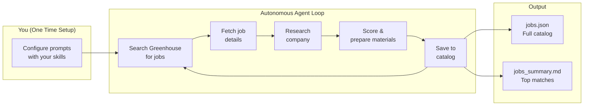
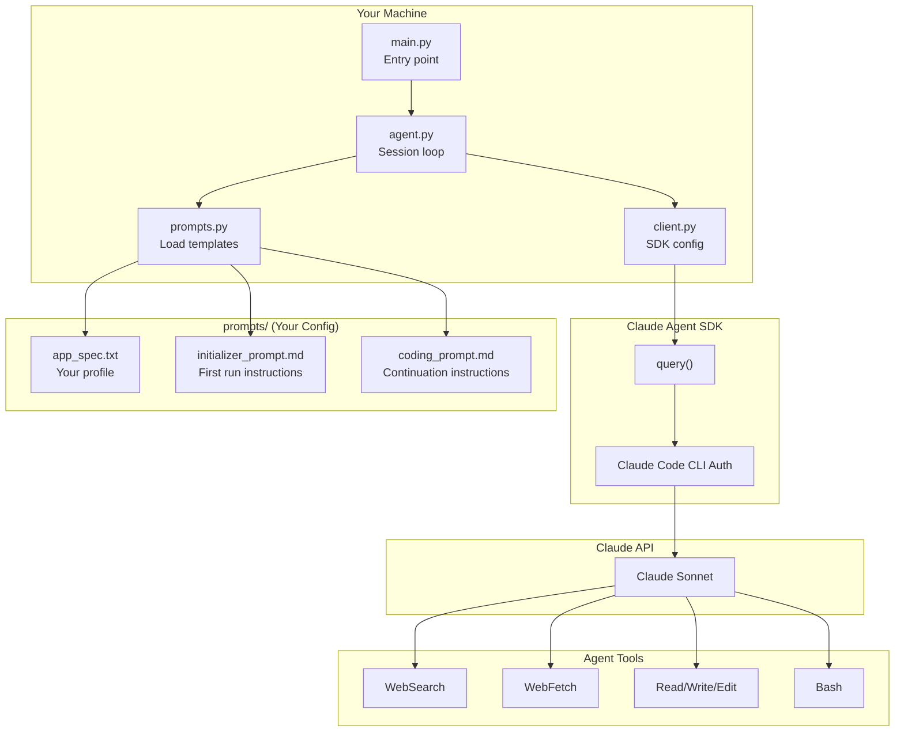
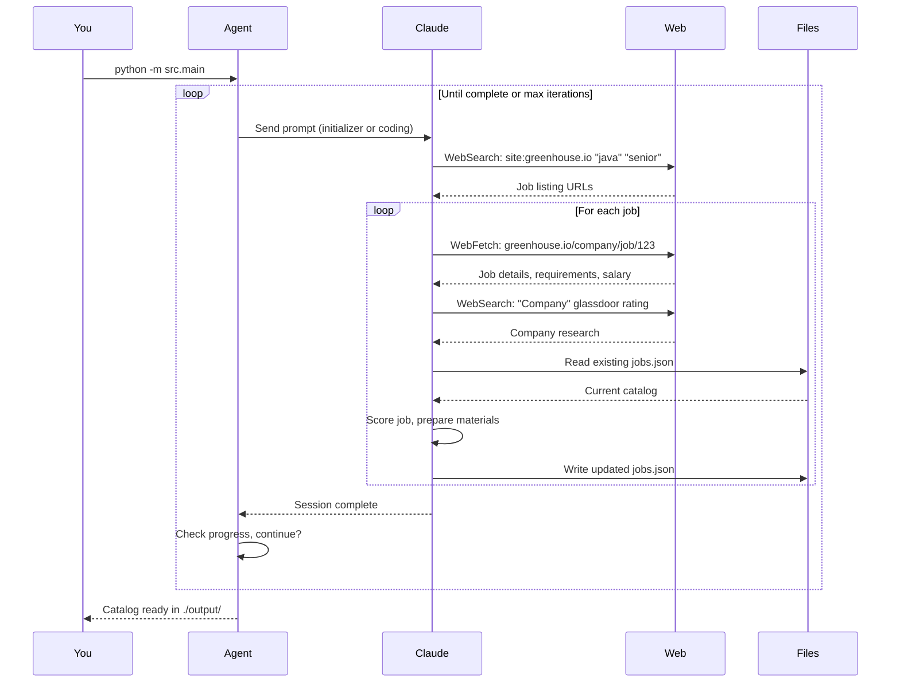

# autonomous-job-search

> Autonomous job search agent powered by Claude. Finds Greenhouse jobs, researches companies, and prepares application materials - you just apply.

## How It Works

This tool uses the **Claude Agent SDK** which leverages your existing **Claude Code CLI** authentication. No API keys to manage - if you're logged into Claude Code, you're ready to go.



## Architecture



## Quick Start

### Prerequisites

- Python 3.12+
- [Claude Code CLI](https://docs.anthropic.com/en/docs/claude-code) installed and authenticated
- That's it! No API key needed.

### Setup

```bash
# Clone
git clone https://github.com/stxkxs/autonomous-job-search.git
cd autonomous-job-search

# Install
uv venv && source .venv/bin/activate
uv pip install -e .

# Configure your profile
cp prompts/app_spec.txt.example prompts/app_spec.txt
cp prompts/coding_prompt.md.example prompts/coding_prompt.md
cp prompts/initializer_prompt.md.example prompts/initializer_prompt.md

# Edit each file with YOUR details (skills, experience, target roles)
# These files are gitignored - your personal info stays private
```

### Run

```bash
# Start the agent
python -m src.main --project-dir ./output

# Watch it work autonomously...
# Ctrl+C to stop (you can resume anytime)
```

## Agent Workflow



## Configuration

### Prompt Files

The `prompts/` directory defines your job search. Files are gitignored to keep your personal details private.

| File | Purpose |
|------|---------|
| `app_spec.txt` | **Your profile** - name, location, skills, experience, target roles |
| `initializer_prompt.md` | **First run** - how to search, what companies to target |
| `coding_prompt.md` | **Continuation** - how to add more jobs without duplicates |

### Example: app_spec.txt

```markdown
# Job Catalog - Your Name

## Candidate Profile
**Location:** Your City (Remote or local)
**Experience:** X+ years, certifications, notable companies

## Core Skills
- Languages: Java, Python, Go
- Cloud: AWS, Kubernetes, Terraform
- Specialty: Platform Engineering, SRE

## Target Roles
1. Staff Platform Engineer
2. Senior SRE
3. Principal Engineer
```

### CLI Options

```bash
# Specify output directory
python -m src.main --project-dir ./my-job-search

# Limit iterations (default: 50)
python -m src.main --max-iterations 10

# Filter by skills
python -m src.main --skills java kubernetes aws

# Use different model
python -m src.main --model claude-sonnet-4-5-20250514
```

## Output

```
output/
├── data/
│   ├── jobs/
│   │   └── jobs.json      # Full job catalog
│   └── companies/
│       └── companies.json # Company research
└── jobs_summary.md        # Human-readable summary
```

### Job Entry Example

```json
{
  "id": "job-001",
  "job_url": "https://boards.greenhouse.io/company/jobs/12345",
  "company": "TechCorp",
  "role": "Senior Platform Engineer",
  "location": "Remote (US)",
  "salary": "$180k-220k",
  "match_score": 92,
  "requirements": ["Java", "AWS", "Kubernetes", "5+ years"],
  "tech_stack": ["Java", "Spring Boot", "AWS", "Terraform"],
  "glassdoor_rating": "4.2",
  "company_size": "500-1000",
  "funding": "Series C",
  "why_good_fit": "Strong platform focus, uses your exact stack",
  "experience_to_highlight": [
    "Built multi-tenant K8s platform at Previous Co",
    "AWS Solutions Architect Pro certification"
  ],
  "questions_to_ask": [
    "What's the platform team's relationship with product teams?",
    "How do you handle multi-region deployments?"
  ]
}
```

## Why Greenhouse Only?

Greenhouse is a popular ATS among well-funded tech companies:

- **Consistent URLs** - All jobs at `boards.greenhouse.io/company/jobs/id` making them easy to search and scrape
- **Quality signal** - Greenhouse costs money, so companies using it tend to be better resourced
- **Predictable format** - Job descriptions follow a consistent structure
- **Wide adoption** - Used by Stripe, Airbnb, Datadog, Figma, Notion, Cloudflare, Discord, and many more

You can modify the prompts to target other ATS platforms (Lever, Ashby, Workday) if needed.

## Resuming & Iteration

The agent is designed for iterative use:

```bash
# First run - initializes catalog
python -m src.main --project-dir ./output

# Later - continues where you left off
python -m src.main --project-dir ./output

# The agent reads existing jobs.json and avoids duplicates
```

## Project Structure

```
autonomous-job-search/
├── src/
│   ├── main.py       # CLI entry point
│   ├── agent.py      # Session loop & iteration
│   ├── client.py     # Claude Agent SDK config
│   ├── prompts.py    # Load prompt templates
│   ├── progress.py   # Progress tracking
│   └── security.py   # Input validation
├── prompts/
│   ├── *.example     # Template files (committed)
│   └── *.txt/*.md    # Your config (gitignored)
├── tests/
└── output/           # Generated job catalog
```

## License

MIT
